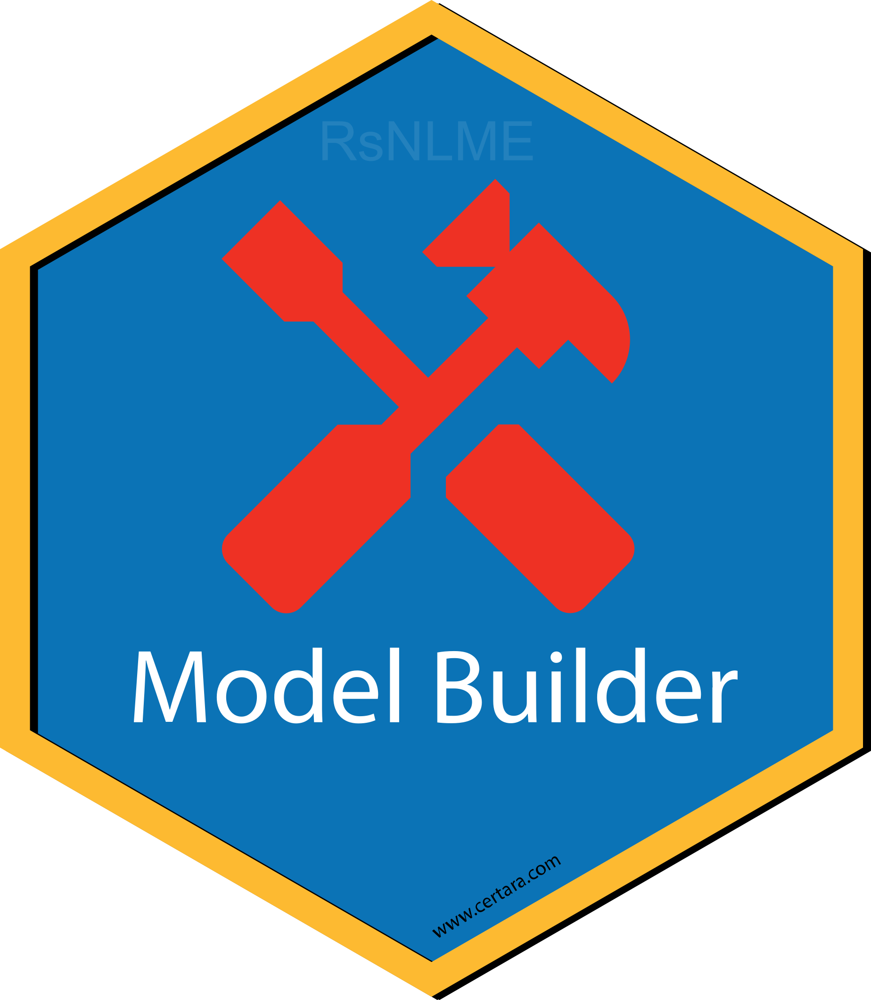
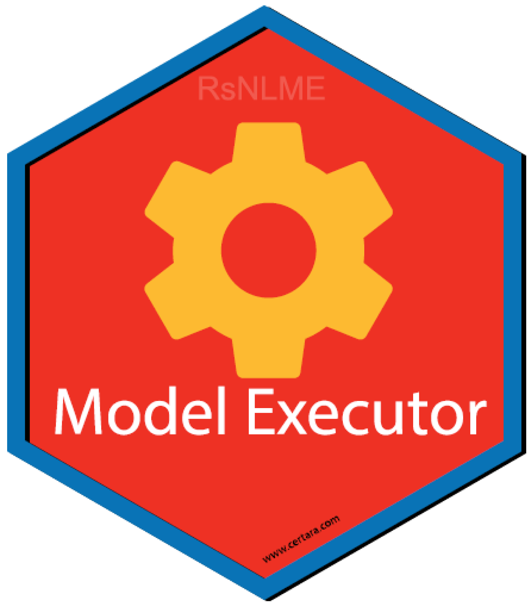

<div id="banner-container" style="background: url('https://www-cdn-images.certara.com/spai5/w_1920+q_lossy+ret_img+to_auto/https://www.certara.com/app/uploads/2022/01/Certara_Hero_R-speaks-RsNLME.png') no-repeat; background-size: cover; background-position: center;"><div class="container"><div id="banner-content"><h2 style = "color: #415364;">R Tools for Pharmacometrics</h2><h3 style = "color: #415364;">Learn about R packages and Shiny applications <br> developed by Certara </h3> <a href="https://www.certara.com/company/contact/?cta_btn=Contact+Certara" class="link-yellow-btn mt-4"></a></div></div></div>

---

`Certara.R` provides a collection of packages and Shiny applications designed for Pharmacometric workflows in R. Shiny applications provide the ability to generate R code given point-and-click operations, enabling a reproducible and extensible workflow from Shiny GUI to RStudio.

### Installation and Running Information

``` r
# Example (not yet on CRAN)
install.packages("Certara.R")

Certara.R::install_certara_packages()
```


### RsNLME 

[`Certara.RsNLME`](https://certara.github.io/R-RsNLME/index.html) uses [tidyverse](https://www.tidyverse.org/) syntax to build Non-Linear-Mixed-Effects (NLME) models in R. Create and execute NLME models using built-in R functions, or execute models with [PML](https://www.certara.com/training/pml-school/) code used in [Phoenix PK/PD Platform](https://www.certara.com/software/phoenix-pkpd/).

---

<br/><br/>

### RsNLME.ModelBuilder 

[`Certara.RsNLME.ModelBuilder`](https://certara.github.io/R-RsNLME-model-builder/index.html) is an R package and Shiny application used to build an RsNLME model.

Use the GUI to select from various model building options and observe the PML update in real time. Additionally, users may generate the corresponding RsNLME code to learn reproduce the model object from R.

---

<br/><br/>

### RsNLME.ModelExecutor 

[`Certara.RsNLME.ModelExecutor`](https://certara.github.io/R-RsNLME-model-executor/index.html) is an R package and Shiny application used to execute an RsNLME model.

Use the GUI to add additional output tables, specify engine parameters, select various run types, and more!

---

<br/><br/>

### ModelResults 

[`Certara.ModelResults`](https://certara.github.io/R-model-results/index.html) is an R package and Shiny GUI used to generate, customize, and report model diagnostic plots and tables from NLME or NONMEM runs.

Users are not limited by the GUI however, Certara.ModelResults will generate the underlying `flextable` and `xpose`/`ggplot2` code (`.R` and/or `.Rmd`) for you inside the Shiny application, which you can then use to recreate your plot and table objects in R, ensuring reproducibility and trace-ability of model diagnostics for reporting output.

---

<br/><br/>

### XposeNLME 

[`Certara.Xpose.NLME`](https://certara.github.io/R-Xpose-NLME/index.html) is an R package used to creates `xpose` databases (`xpose_data`) for PML/NLME results. Additionally, [`Certara.Xpose.NLME`](https://certara.github.io/R-Xpose-NLME/index.html) offers various covariate model diagnostic functions, not available in the `xpose` package.

---

<br/><br/>

### VPCResults 

[`Certara.VPCResults`](https://certara.github.io/R-VPCResults/index.html) is an R package and Shiny application used to parameterize and plot a Visual Predictive Check (VPC).

Use the GUI to select from various binning or binless methods and specify options such as censoring, stratification, and prediction-corrected.

Users are not limited by the GUI however, [`Certara.VPCResults`](https://certara.github.io/R-VPCResults/index.html) will generate the underlying `tidyvpc` and `ggplot2` code (`.R` and/or `.Rmd`) for you inside the Shiny application, which you can then use to recreate your plot and table objects in R, ensuring reproducibility of VPC’s for reporting output.

---

<br/><br/>

### tidyvpc 

The [`tidyvpc`](https://certara.github.io/tidyvpc/index.html) package is used to perform a Visual Predictive Check (VPC), while accounting for stratification, censoring, and prediction correction. 

Using piping from 'magrittr', the intuitive syntax gives users a flexible and powerful method to generate VPCs using both traditional binning and a new binless approach Jamsen et al. (2018) [doi:10.1002/psp4.12319](https://www.ncbi.nlm.nih.gov/pmc/articles/PMC6202468/) with Additive Quantile Regression (AQR) and Locally Estimated Scatterplot Smoothing (LOESS) prediction correction. 

---

<br/><br/>

### ggquickeda 

[`ggquickeda`](https://github.com/smouksassi/ggquickeda) is an R Shiny app/package providing a graphical user interface (GUI) to `ggplot2` and `table1`.

It enables you to quickly explore your data and to detect trends on the fly. Create scatter plots, dotplots, boxplots, barplots, histograms, densities and summary statistics of one or multiple variable(s) by column(s) splits and an optional overall column.

In addition, `ggquickeda` also provides the km, kmband and kmticks geoms/stats to facilitate the plotting of Kaplan-Meier Survival curves.

For a quick overview using an older version of the app head to this [YouTube Tutorial](https://www.youtube.com/watch?v=1rBBmJUIZhs).

---

<br/><br/>

### ggcertara 

[`ggcertara`](https://github.com/certara/ggcertara) is an R package to provide used to provide a standardized look for plots employed by pharmacometricians. It provides a `ggplot2` theme, color palette, and a collection of plotting functions for basic goodness-of-fit diagnostic plots.

See the following [vignette](https://certara.github.io/ggcertara/vignettes/ggcertara-gof.html) for an overview of the package.

---

<br/><br/>

### table1c 

[`table1c`](https://github.com/certara/table1c) is an R package for generating tables of descriptive statistics in HTML. It is a light wrapper around the table1 package with some customizations for the convenience of Certara IDD.

See the following [vignette](https://certara.github.io/table1c/vignettes/table1c-howto.html) for an overview of the package.

---

<br/><br/>

### coveffectsplot 

[`coveffectsplot`](https://github.com/smouksassi/coveffectsplot) is an R package that provide the function forest_plot and an accompanying Shiny application that facilitates the production of forest plots to visualize covariate effects as commonly used in pharmacometrics population PK/PD report

Learn more about the package [here](https://github.com/smouksassi/coveffectsplot).

---

<br/><br/>
