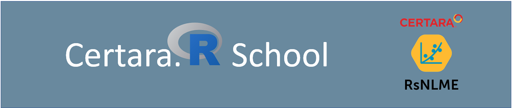

# Certara R School

  

[Certara.R School](https://vimeo.com/showcase/certararschool) is a
series of guided webinars, exercises, and interactive tutorials for the
application of R in Pharmacometrics.

Why R? R is the primary programming language in the Pharmacometrician’s
toolkit and offers unparalleled efficiency, flexibility, and
reproducibility compared to working inside a GUI alone. Learning R can
be challenging at first, but Certara is here to help!

The following lessons will demonstrate how to begin using R in your
Pharmacometric workflow. We will cover everything from
installation/environment setup to creating interactive dashboards to
communicate your analysis – let’s get started!

*Note: While an `RsNLME` license is not mandatory to participate, many
of the lectures will cover core pharmacometric workflows using the
`RSNLME` package. License options are available for Certara.R school
participants via the links below.*

- [Request Certara.R School RsNLME Trial
  License](mailto:certara.licensing@certara.com?subject=Certara.R%20School%20RsNLME%20Trial%20License&body=Hello,%20I%20have%20registered%20for%20the%20upcoming%20Certara.R%20School%20webinar%20and%20request%20a%2090-day%20trial%20license%20for%20RsNLME:%20%0d%0a%0d%0a%0AName:%20%0d%0a%0AEmail:%20%0d%0a%0AOrganization/Institution:)

- [Request RsNLME Academic
  License](mailto:certara.licensing@certara.com?subject=RsNLME%20Academic%20License&body=Hello,%20I%20am%20requesting%20an%20academic%20license%20for%20RsNLME:%20%0d%0a%0d%0a%0AName:%20%0d%0a%0AAcademic%20Email:%20%0d%0a%0AAcademic%20Institution:)

Learn how to access [Certara.R School lesson
files](https://github.com/certara/R-Certara/tree/master/inst/Certara_R_School)
using [GitHub Desktop](https://desktop.github.com/) in the following
[video](https://github.com/certara/R-Certara/articles/lesson_materials.md).

------------------------------------------------------------------------

## [Lesson 0: Introduction to Certara.R School](https://github.com/certara/R-Certara/articles/lesson_0.md)

- Webinar Date: *Pre-recorded*

------------------------------------------------------------------------

## [Lesson 1: Getting Started with RsNLME](https://github.com/certara/R-Certara/articles/lesson_1.md)

- Webinar Date: *4/28/2022 @10am EST*

------------------------------------------------------------------------

## [Lesson 2: R Basics for PMx](https://github.com/certara/R-Certara/articles/lesson_2.md)

- Webinar Date: *6/8/2022 @10am EST*

------------------------------------------------------------------------

## [Lesson 3: Exploratory Data Analysis](https://github.com/certara/R-Certara/articles/lesson_3.md)

- Webinar Date: *6/22/2022 @10am EST*

------------------------------------------------------------------------

## [Lesson 4: Modeling with RsNLME](https://github.com/certara/R-Certara/articles/lesson_4.md)

- Webinar Date: *7/27/2022 @10am EST*

------------------------------------------------------------------------

## [Lesson 5: Model Diagnostics](https://github.com/certara/R-Certara/articles/lesson_5.md)

- Webinar Date: *8/23/2022 @10am EST*

------------------------------------------------------------------------

## [Lesson 6: Model Refinement](https://github.com/certara/R-Certara/articles/lesson_6.md)

- Webinar Date: *9/28/2022 @10am EST*

------------------------------------------------------------------------

## [Lesson 7: Simulation](https://github.com/certara/R-Certara/articles/lesson_7.md)

- Webinar Date: *10/26/2022 @10am EST*

------------------------------------------------------------------------

## [Lesson 8: Visual Predictive Check (VPC)](https://github.com/certara/R-Certara/articles/lesson_8.md)

- Webinar Date: *11/30/2022 @10am EST*

------------------------------------------------------------------------

## [Lesson 9: RsNLME Case Study](https://github.com/certara/R-Certara/articles/lesson_9.md)

- Webinar Date: *3/29/2023 @10am EST*

------------------------------------------------------------------------

## [Lesson 10: Best Practices for Reproducibility in R](https://github.com/certara/R-Certara/articles/lesson_10.md)

- Webinar Date: *5/24/2023 @10am EST*

------------------------------------------------------------------------

## [Lesson 11: Advanced R Markdown](https://github.com/certara/R-Certara/articles/lesson_11.md)

- Webinar Date: *8/30/2023 @10am EST*

------------------------------------------------------------------------

## [Lesson 12: History and Advantages of the PML Language](https://github.com/certara/R-Certara/articles/lesson_12.md)

- Webinar Date: *9/27/2023 @10am EST*

------------------------------------------------------------------------

## [Lesson 13: Hands-on Application of PML in R](https://github.com/certara/R-Certara/articles/lesson_13.md)

- Webinar Date: *12/13/2023 @10am EST*

------------------------------------------------------------------------
