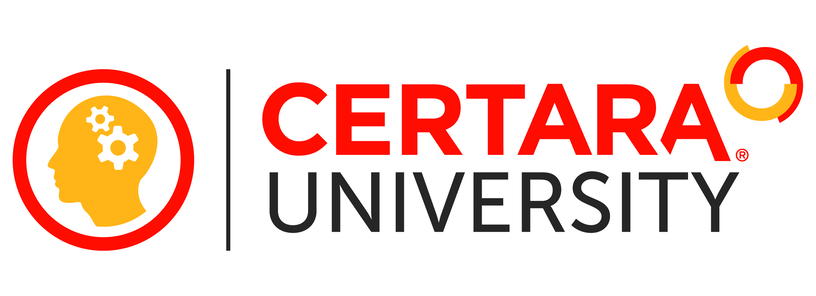

# Learning Resources

  
  

## Certara University 

[Certara
University](https://www.certara.com/training/certara-university/)
provides public and on-site corporate training. The format of the
courses can either be online, live online, and in-person at your
company’s site.

In addition, customized training courses or videos on modeling and
simulation can be developed for companies to facilitate your learning
and development goals. Our programs are designed for novice and advanced
users in the area of pharmacokinetic (PK) and pharmacodynamics (PD) and
are taught using Certara software including the industry-standard
software Phoenix WinNonlin™.

  
  

------------------------------------------------------------------------

  
  

## R/Pharma 

[R/Pharma](https://rinpharma.com/) is an organization focused on the use
of R in the development of pharmaceuticals. Visit their
[website](https://rinpharma.com/publication/) to discover recent
webinars and publications about the usage of R in drug development.

  
  

------------------------------------------------------------------------

  
  

## RStudio Community 

The [RStudio Community](https://community.rstudio.com/) is a discussion
board for asking questions about R, Shiny, and package development. If
you have a question about a particular R code issue, we’d recommend
starting by creating a reproducible example (or reprex). This will often
help as the process of creating an example will help you think about
your problem in a way that may help solve it, and will help to capture
the problem in a way that will allow others to clearly understand the
issue.

See [here](https://www.tidyverse.org/help/) for more on creating a
reprex.

  
  

------------------------------------------------------------------------

  
  

## Stack Overflow 

[Stack Overflow](https://stackoverflow.com/) is a question-answer site
which is one of the most trusted online community for developers. It has
over 50+ Million visitors every month, 51000 registered reputed
developers and over 19 million answers. You can find help from some of
the best developers in the industry with expertise in their domains.

[Stack Overflow](https://stackoverflow.com/) is an important resource
for seeking answers to questions about R - in particular we’d recommend
making sure your question is tagged as “R” or “RsNLME”.

  
  
