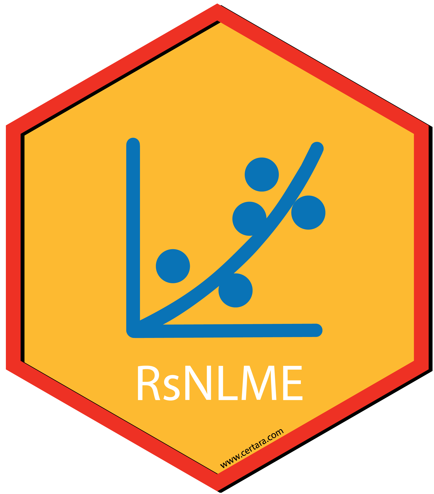
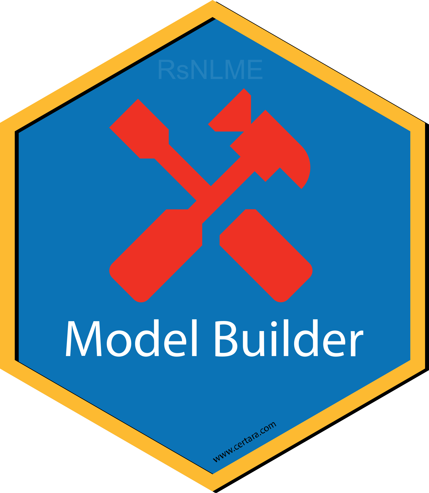
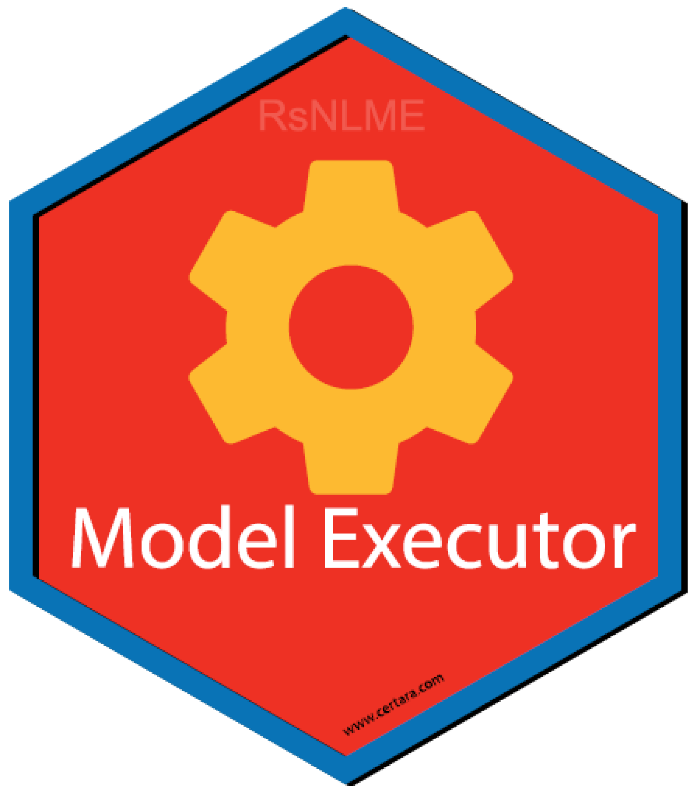
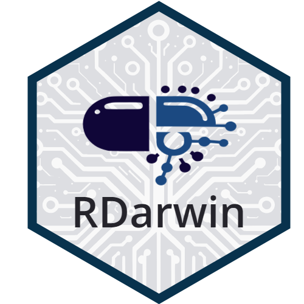
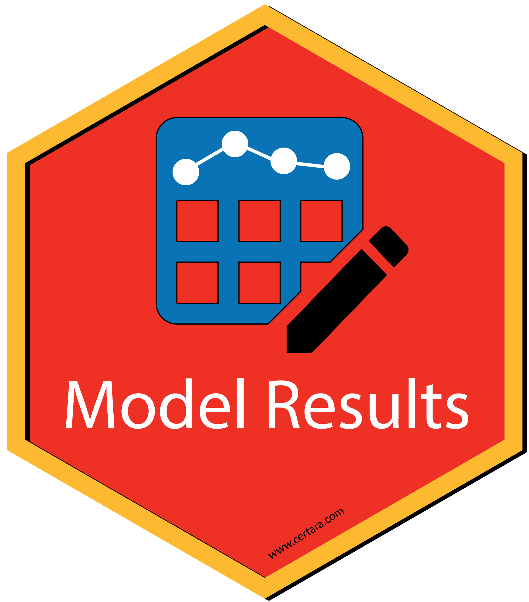
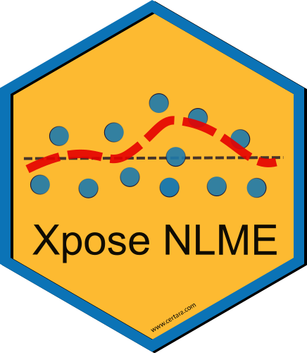
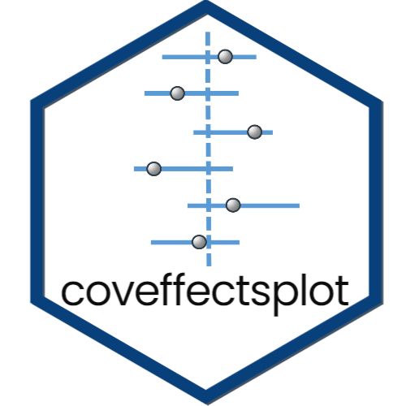
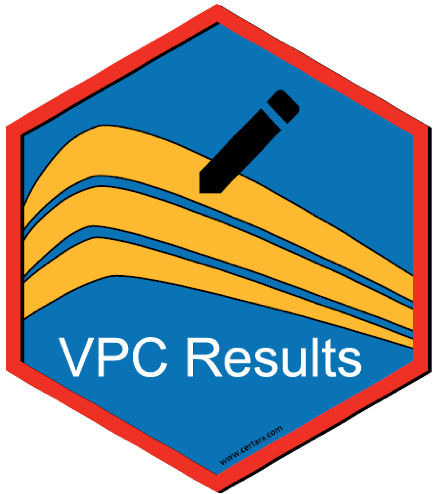
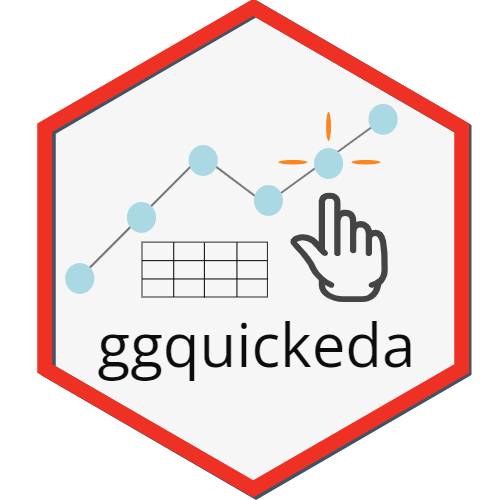

## R Tools for Pharmacometrics

### Learn about R packages and Shiny applications developed by Certara

[](https://www.certara.com/company/contact/?cta_btn=Contact+Certara)

------------------------------------------------------------------------


  

`Certara.R` is the meta-package for the Certara pharmacometrics R
ecosystem: [`library(Certara.R)`](https://github.com/certara/R-Certara)
attaches the installed suite (RsNLME, Shiny apps, reporting tools, and
more). It also hosts the optional federated Certara Model Context
Protocol (MCP) server, which exposes knowledge-base and tool providers
from member packages to AI coding assistants (Cursor, Claude Code,
Codex, and Claude Desktop). Shiny applications provide the ability to
generate R code given point-and-click operations, enabling a
reproducible and extensible workflow from Shiny GUI to RStudio. [Learn
more](https://certara.github.io/R-Certara/articles/why_learn_r.html)

### Installation

Install `Certara.R` and the packages it manages, then attach the suite
in one call:

``` r

install.packages(
  "Certara.R",
  dependencies = TRUE,
  repos = c(
    "https://certara.jfrog.io/artifactory/certara-cran-release-public/",
    "https://cloud.r-project.org"
  )
)
library(Certara.R)  # attaches the installed member packages
```

The two URLs in the `repos =` argument tell
[`install.packages()`](https://rdrr.io/r/utils/install.packages.html)
where to look: the first is **Certara’s own package repository**, the
second is **CRAN**. Certara’s repository is listed first so the newest
Certara releases are found before CRAN. (On Windows,
[`install.packages()`](https://rdrr.io/r/utils/install.packages.html)
still prefers a binary of the same version, so once CRAN carries that
version as a binary it is used; CRAN also supplies a few dependencies
that live only there.) Any suite packages you have not installed are
simply skipped when you run
[`library(Certara.R)`](https://github.com/certara/R-Certara).

`Certara.RsNLME` additionally requires the NLME-Engine (Windows and
Linux only) — see the [RsNLME installation
guide](https://certara.github.io/R-RsNLME/articles/installation.html).

### AI assistant (MCP) — optional

Modeling and reporting do **not** require MCP. To connect an AI coding
assistant (Cursor, Claude Code, Codex, or Claude Desktop), write its
configuration once:

``` r

Certara.R::write_mcp_config(client = "claude-desktop", scope = "user")
```

- Supported clients: Cursor, Claude Code, Codex, and Claude Desktop
- First MCP call in a session:
  [`certara_mcp_capabilities()`](https://github.com/certara/R-Certara/reference/certara_mcp_capabilities.md)
- MCP sessions can emit audit-ready R scripts for QC
- Full setup, tool profiles, and troubleshooting: the [Certara MCP
  Server: Setup and
  Usage](https://certara.github.io/R-Certara/articles/mcp_setup.html)
  vignette, or
  [`?write_mcp_config`](https://github.com/certara/R-Certara/reference/write_mcp_config.md)

## Modeling

The `RsNLME` suite of packages use Certara’s NLME-Engine for execution.
Create, edit, and execute a Phoenix NLME model, directly from R!

### [RsNLME](https://certara.github.io/R-RsNLME/index.html) [](https://certara.github.io/R-RsNLME/index.html)

[`Certara.RsNLME`](https://certara.github.io/R-RsNLME/index.html) uses
[tidyverse](https://www.tidyverse.org/) syntax to build
Non-Linear-Mixed-Effects (NLME) models in R. Create and execute NLME
models using built-in R functions, or execute models with
[PML](https://www.certara.com/training/pml-school/) code used in
[Phoenix PK/PD
Platform](https://www.certara.com/software/phoenix-pkpd/).

------------------------------------------------------------------------

  

### [RsNLME.ModelBuilder](https://certara.github.io/R-RsNLME-model-builder/index.html) [](https://certara.github.io/R-RsNLME-model-builder/index.html)

[`Certara.RsNLME.ModelBuilder`](https://certara.github.io/R-RsNLME-model-builder/index.html)
is an R package and Shiny application used to build an RsNLME model.

Use the GUI to select from various model building options and observe
the PML update in real time. Additionally, users may generate the
corresponding RsNLME code to reproduce the model object from R.

  

------------------------------------------------------------------------

  

### [RsNLME.ModelExecutor](https://certara.github.io/R-RsNLME-model-executor/index.html) [](https://certara.github.io/R-RsNLME-model-executor/index.html)

[`Certara.RsNLME.ModelExecutor`](https://certara.github.io/R-RsNLME-model-executor/index.html)
is an R package and Shiny application used to execute an RsNLME model.

Use the GUI to add additional output tables, specify engine parameters,
select various run types, and more!

  

------------------------------------------------------------------------

  

## Machine Learning Model Development Tools

### [RDarwin](https://certara.github.io/R-Darwin/index.html) [](https://certara.github.io/R-Darwin/index.html)

[`Certara.RDarwin`](https://certara.github.io/R-Darwin/index.html) is an
R package designed to facilitate the usage of
[pyDarwin](https://certara.github.io/pyDarwin/html/index.html) with the
Certara NLME pharmacometric modeling engine from the R command line. The
Python package, pyDarwin, is a powerful tool for using machine learning
algorithms for model selection.

  

------------------------------------------------------------------------

  

### [DarwinReporter](https://certara.github.io/R-DarwinReporter/index.html) [](https://certara.github.io/R-DarwinReporter/index.html)

[`Certara.DarwinReporter`](https://certara.github.io/R-DarwinReporter/index.html)
is an R package that provides a Shiny application, in addition to
various plotting and data summary functions, for analyzing results of a
[pyDarwin](https://certara.github.io/pyDarwin/html/index.html) automated
machine learning based model search.

  

------------------------------------------------------------------------

  

## Simcyp™

The `Simcyp` R package supports R script interactions with the [Simcyp™
PBPK Simulator](https://www.certara.com/software/simcyp-pbpk/), a
propriety software used for modeling and simulation for pharmaceutical
and other applications in life sciences. This package allows users to
load and modify workspaces, run the physiologically based
pharmacokinetics models (PBPK) developed in Simcyp™ and interrogate
results. To use this package, the user must have a Simcyp™ Simulator
license.

To request access to the latest `Simcyp` R package, please contact us at
<simcyp.support@certara.com>.

Example Simcyp™ R scripts can be found
[here](https://github.com/certara/Simcyp-R-Scripts).

### [Certara.SimcypVBE](https://certara.github.io/R-SimcypVBE/index.html)

[`Certara.SimcypVBE`](https://certara.github.io/R-SimcypVBE/index.html)
is an R package and Shiny application integrated within
[Pirana](https://www.certara.com/software/pirana-modeling-workbench/)
for extensible R based Virtual Bioequivalence (VBE) workflows using the
Simcyp™ Simulator. The `Certara.SimcypVBE` package requires the `Simcyp`
package and
[Pirana](https://www.certara.com/software/pirana-modeling-workbench/) in
order to use.

  

------------------------------------------------------------------------

  

## Diagnostic Plots and Tables

### [ModelResults](https://certara.github.io/R-model-results/index.html) [](https://certara.github.io/R-model-results/index.html)

[`Certara.ModelResults`](https://certara.github.io/R-model-results/index.html)
is an R package and Shiny GUI used to generate, customize, and report
model diagnostic plots and tables from NLME or NONMEM runs.

Users are not limited by the GUI however, Certara.ModelResults will
generate the underlying `flextable` and `xpose`/`ggplot2` code (`.R`
and/or `.Rmd`) for you inside the Shiny application, which you can then
use to recreate your plot and table objects in R, ensuring
reproducibility and trace-ability of model diagnostics for reporting
output.

  

------------------------------------------------------------------------

  

### [XposeNLME](https://certara.github.io/R-Xpose-NLME/index.html) [](https://certara.github.io/R-Xpose-NLME/index.html)

[`Certara.Xpose.NLME`](https://certara.github.io/R-Xpose-NLME/index.html)
is an R package used to creates `xpose` databases (`xpose_data`) for
PML/NLME results. Additionally,
[`Certara.Xpose.NLME`](https://certara.github.io/R-Xpose-NLME/index.html)
offers various covariate model diagnostic functions, not available in
the `xpose` package.

  

------------------------------------------------------------------------

  

### [coveffectsplot](https://smouksassi.github.io/coveffectsplot/) [](https://smouksassi.github.io/coveffectsplot/)

[`coveffectsplot`](https://github.com/smouksassi/coveffectsplot) is an R
package that provide the function forest_plot and an accompanying Shiny
application that facilitates the production of forest plots to visualize
covariate effects as commonly used in pharmacometrics population PK/PD
report

Learn more about the package
[here](https://github.com/smouksassi/coveffectsplot).

  

------------------------------------------------------------------------

  

## Visual Predictive Check (VPC)

### [VPCResults](https://certara.github.io/R-VPCResults/index.html) [](https://certara.github.io/R-VPCResults/index.html)

[`Certara.VPCResults`](https://certara.github.io/R-VPCResults/index.html)
is an R package and Shiny application used to parameterize and plot a
Visual Predictive Check (VPC).

Use the GUI to select from various binning or binless methods and
specify options such as censoring, stratification, and
prediction-corrected.

Users are not limited by the GUI however,
[`Certara.VPCResults`](https://certara.github.io/R-VPCResults/index.html)
will generate the underlying `tidyvpc` and `ggplot2` code (`.R` and/or
`.Rmd`) for you inside the Shiny application, which you can then use to
recreate your plot and table objects in R, ensuring reproducibility of
VPC’s for reporting output.

  

------------------------------------------------------------------------

  

### [tidyvpc](https://certara.github.io/tidyvpc/index.html) [](https://certara.github.io/tidyvpc/index.html)

The [`tidyvpc`](https://certara.github.io/tidyvpc/index.html) package is
used to perform a Visual Predictive Check (VPC), while accounting for
stratification, censoring, and prediction correction.

Using piping from ‘magrittr’, the intuitive syntax gives users a
flexible and powerful method to generate VPCs using both traditional
binning and a new binless approach Jamsen et al. (2018)
[doi:10.1002/psp4.12319](https://www.ncbi.nlm.nih.gov/pmc/articles/PMC6202468/)
with Additive Quantile Regression (AQR) and Locally Estimated
Scatterplot Smoothing (LOESS) prediction correction.

  

------------------------------------------------------------------------

  

## Exploratory Data Analysis (EDA)

### [ggquickeda](https://smouksassi.github.io/ggquickeda/) [](https://smouksassi.github.io/ggquickeda/)

[`ggquickeda`](https://github.com/smouksassi/ggquickeda) is an R Shiny
app/package providing a graphical user interface (GUI) to `ggplot2` and
`table1`.

It enables you to quickly explore your data and to detect trends on the
fly. Create scatter plots, dotplots, boxplots, barplots, histograms,
densities and summary statistics of one or multiple variable(s) by
column(s) splits and an optional overall column.

In addition, `ggquickeda` also provides the km, kmband and kmticks
geoms/stats to facilitate the plotting of Kaplan-Meier Survival curves.

For a quick overview using an older version of the app head to this
[YouTube Tutorial](https://www.youtube.com/watch?v=1rBBmJUIZhs).

  

------------------------------------------------------------------------

## Data Management

### [Certara.IntegralR](https://certara.github.io/R-Integral/index.html)

[`Certara.IntegralR`](https://certara.github.io/R-Integral/index.html)
is an R interface to Certara’s
[Integral](https://www.certara.com/integral-data-repository/) data
repository, enabling programmatic access to pharmacometric study data,
models, and metadata.

It allows scientists to integrate Integral directly into reproducible R
workflows for data retrieval, analysis, and automation across PK/PD
modeling pipelines.

  

------------------------------------------------------------------------

## Other

### [ggcertara](https://github.com/certara/ggcertara)

[`ggcertara`](https://github.com/certara/ggcertara) is an R package to
provide used to provide a standardized look for plots employed by
pharmacometricians. It provides a `ggplot2` theme, color palette, and a
collection of plotting functions for basic goodness-of-fit diagnostic
plots.

See the following
[vignette](https://certara.github.io/ggcertara/vignettes/ggcertara-gof.html)
for an overview of the package.

  

------------------------------------------------------------------------

  

### [table1c](https://github.com/certara/table1c)

[`table1c`](https://github.com/certara/table1c) is an R package for
generating tables of descriptive statistics in HTML. It is a light
wrapper around the table1 package with some customizations for the
convenience of Certara IDD.

See the following
[vignette](https://certara.github.io/table1c/vignettes/table1c-howto.html)
for an overview of the package.

  

------------------------------------------------------------------------

  

### [pmxpartabc](https://github.com/certara/pmxpartabc)

[pmxpartabc](https://github.com/certara/pmxpartabc) is an R package for
generating parameter estimates tables. `pmxpartabc` provides ease of
table generation via specification of NONMEM `run_dir` or information
contained in a user-provided `yaml` file. Additional support for
bootstrap estimates is provided.

Visit the [pmxpartabc
website](https://certara.github.io/pmxpartabc/index.html) for examples
of usage details.

  

------------------------------------------------------------------------

  

### [scmreg](https://github.com/certara/scmreg)

The [`scmreg`](https://github.com/certara/scmreg) package provides
functions to perform Stepwise Covariate Modeling (SCM) in R. With the
`scm_reg()` function, you can setup and execute a stepwise covariate
model selection using different regression techniques and easily
generate table output using the `tabscm()` function.

  
