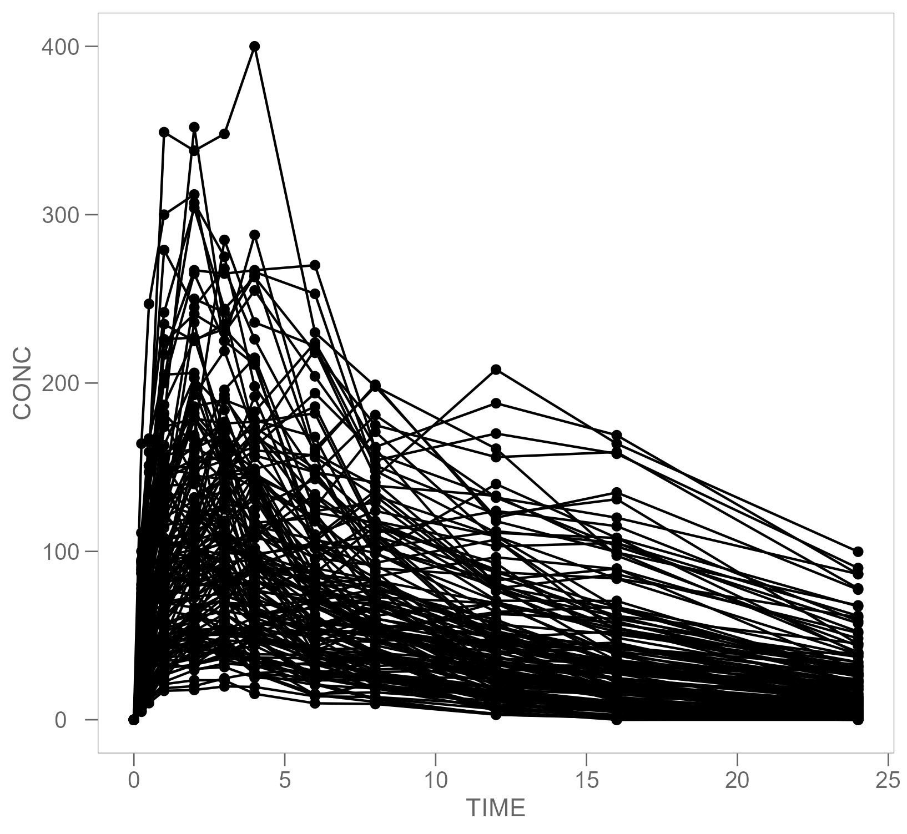
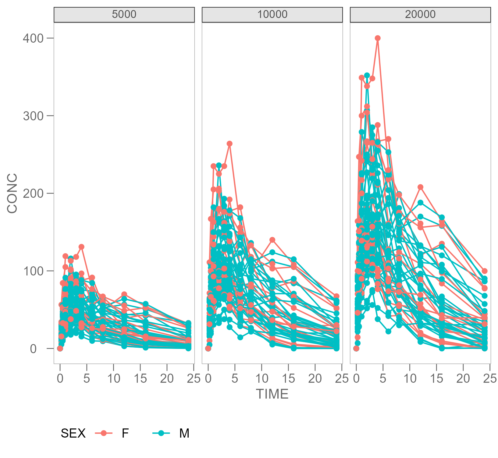
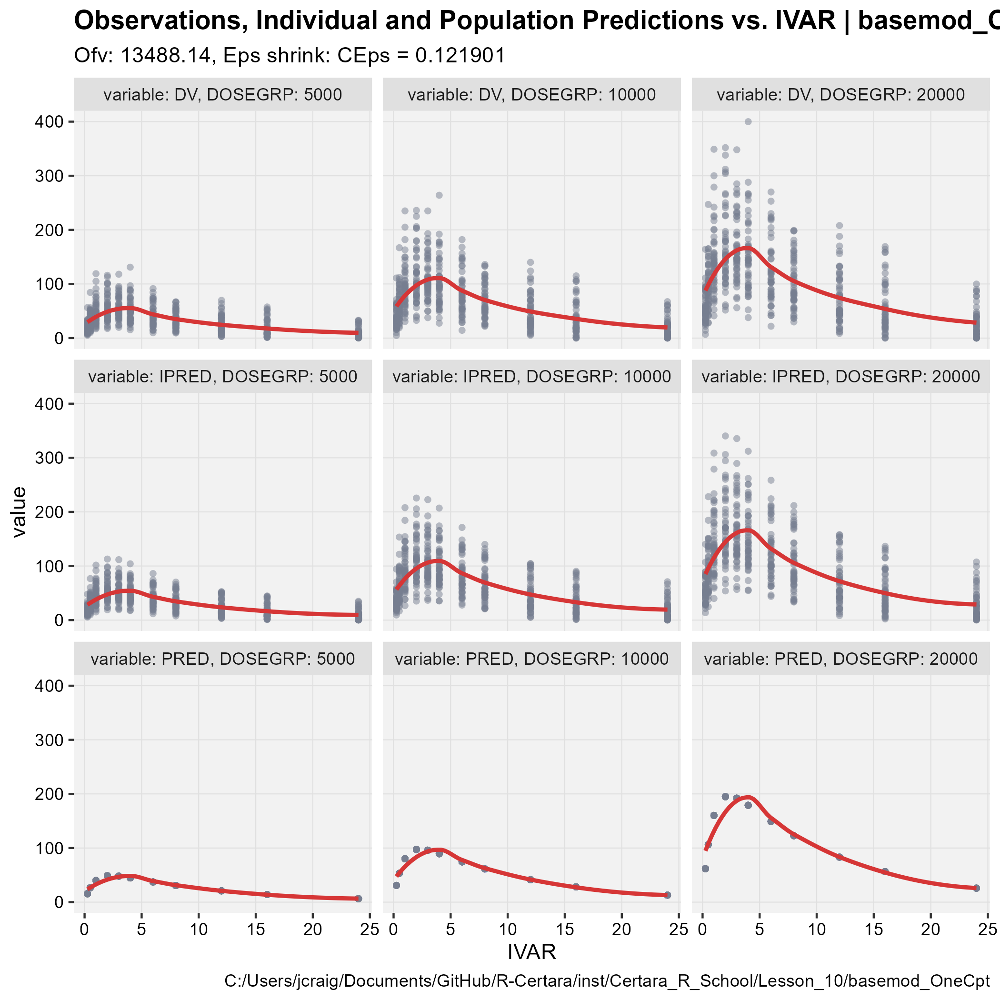
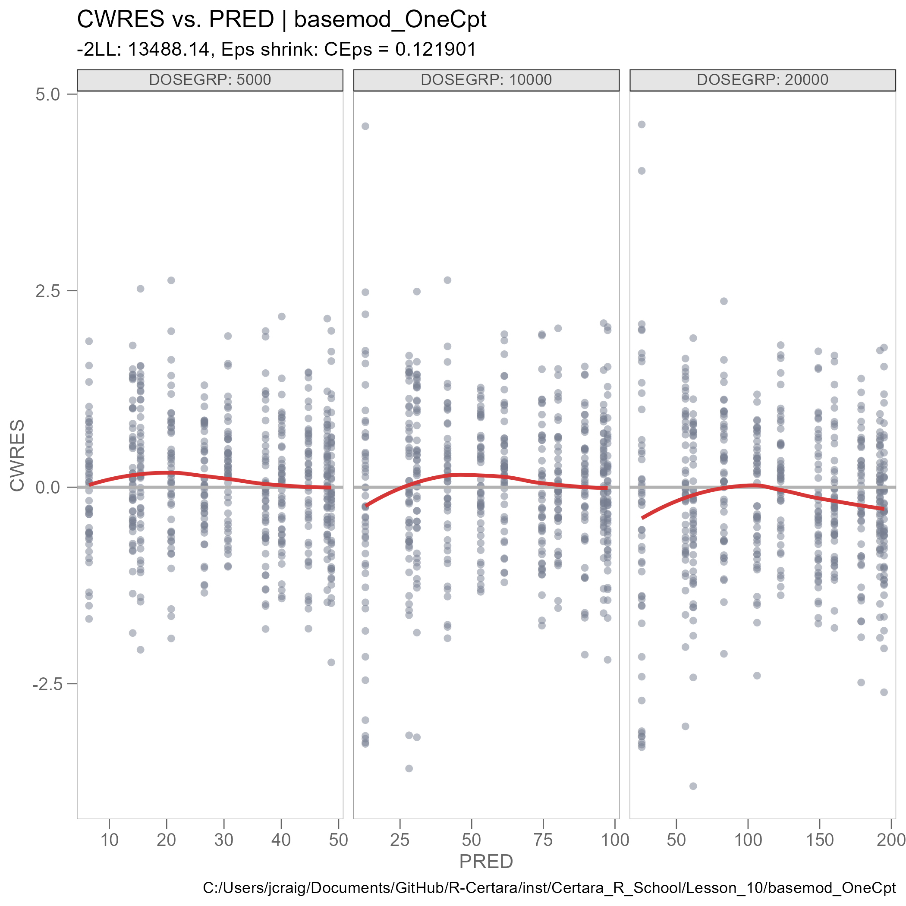

```{r setup, include=FALSE}
knitr::opts_chunk$set(echo = FALSE, fig.align = "left")
```

## Summary

This is an example R Markdown report to demonstrate the workflow for building a "data memo" or report object in parallel with the conduct of your analysis.

---

## Descriptive Statistics

### Demographics Summary

```{r dm_conctable, out.width='40%'}

```

### Mean Concentration by Dose Group and Time

```{r mean_conctable, out.width='60%'}

```

---

## Exploratory Data Analysis (EDA)

### Time Concentration by Subject

```{r time_concentration_by_subject, out.width='50%'}

```

### Time Concentration by Dose Group

```{r time_concentration_facet_dose_group, out.width='50%'}

```

---

## Model Compartment Scenarios

We evaluated the AIC for a one, two, and three compartment fit:

```{r overall_table_cmpt_scenarios, out.width='50%'}

```

We can see that the more parsimonious one compartment model should be selected as the base model.

---

## Model Diagnostic Plots

### DV PRED vs IDV

```{r dv_preds_idv, out.width='50%'}

```

### CWRES vs PRED
```{r res_vs_pred, out.width='50%'}

```

---

## Session Information

```{r session_info}
sessionInfo()
```
